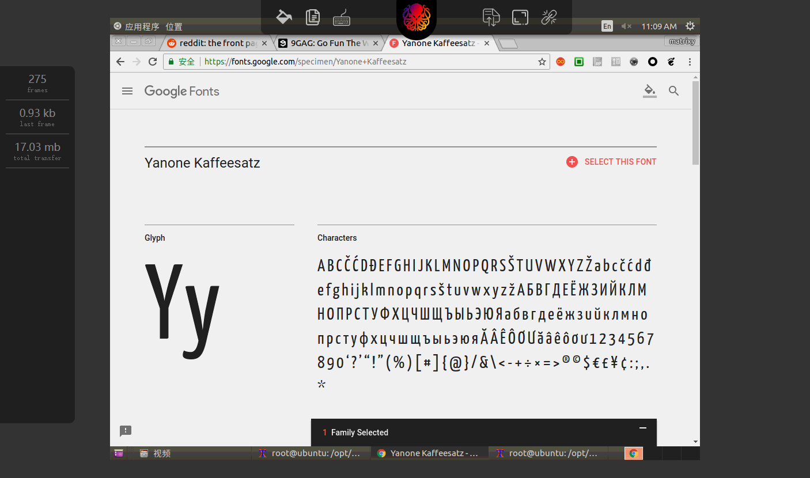
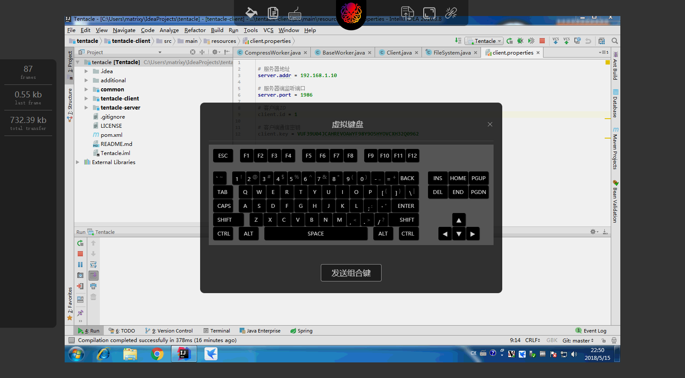
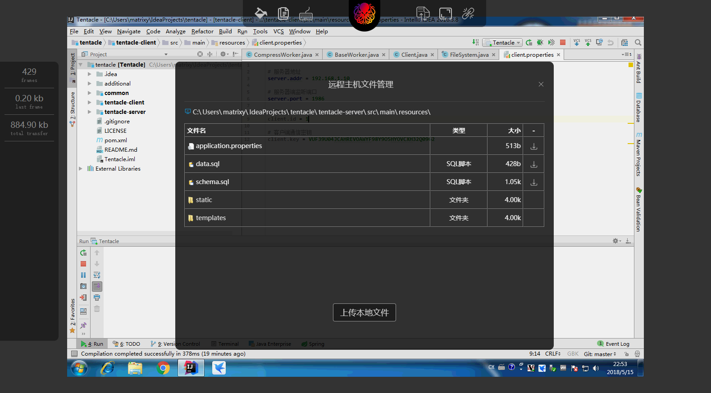

## 基于java和javascript的远程桌面




## 使用
1. 修改配置文件的相应项目，比如监听端口，以及`${rds.access.password}`远程控制访问密码
2. 使用`mvn package`编绎打包，服务器端使用`original-tentacle-server-1.5.9.RELEASE.jar`，被控制的主机端使用`tentacle-client-1.0-SNAPSHOT.jar`。
3. 通过`java -jar original-tentacle-server-1.5.9.RELEASE.jar`启动服务器端
4. 在需要被控制的机器上，使用`java -jar tentacle-client-1.0-SNAPSHOT.jar`来启动主机端，注意控制台输出，显示`INFO: Connected to server...`即表示己成功的连接到服务器端。
5. 在浏览器里输入`http://server_ip:server_port/`，输入`${rds.access.password}`开始远程桌面控制。

## 传输协议
### 基础包结构
```
# 协议标识头
48 45 4E 54 41 49       H E N T A I
01                      指令：心跳
00 00 00 05             数据包长度5字节
48 45 4C 4C 4F          H E L L O
```
### 流程

## 画面传输
### 压缩
1. 行程编码，对于大画积的连续的同色区域压缩率相当显著。
2. 通过简易的位运算的方式，对非灰度颜色值（RR == GG == BB），进行与0b111100001111000011110000按位与运算，变相的对颜色进行了有损压缩，但是因为完全保留了灰度色，对于绝大部分屏幕画面影响很小，对于图像影响很明显。
3. 通过对比两祯间的画面，同一位置的颜色值如果相等，则保留透明色，否则则保留新画面祯的颜色值，如此以来，对于变化较小的画面祯，整个画面的数据包，几乎只传输了变化部分的内容（画面不变则不传输数据）。
4. 目前javascript的解压缩实现与后台的java压缩实现，在`Google Chrome`及`Firefox`上表现相当好，很少有单祯画面解压时间超过10毫秒，未来将进一步考虑更加慢的高压缩比算法，进一步的控制流量的消耗。

### 流程

## 鼠标/键盘交互
因为浏览器端脚本不能百分百的拦截所有的组合键，所以不是所有的组合键都能够用于远程控制端，比如`ALT+TAB`的切换窗口（tentacle在窗口失焦时，将释放所有己按下的按键）。
> 注：向远程主机发送CTRL+ALT+DELETE组合键不起作用，估计使用的`java.awt.Robot`类有安全权限控制。

## 剪切板
因为浏览器安全策略上的原因，故不做剪切板的直接访问，只提供了获取与设置远程主机的剪切板的操作界面与功能。

## TODO
1. 压缩率优化
2. 文件传输
3. windows平台系统解锁/登陆